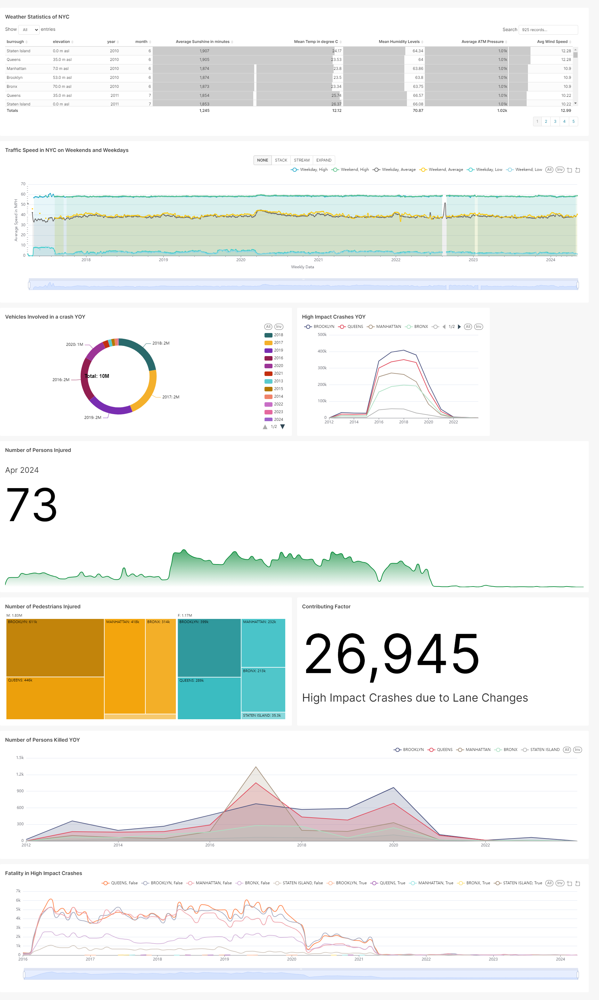

# Analyzing the Impact of Weather, Traffic, and Taxi Usage on Road Safety in NYC

## Table of Contents
- [Directory Structure](#directory-structure)
- [Background](#background)
- [Application Architecture](#application-architecture)
- [Data Engineering Roadmap](#data-engineering-roadmap)
- [Ingest](#ingest)
- [Transformation](#transformation)
- [Storage](#storage)
- [Analysis](#analysis)
- [Management](#management)
- [Screenshots](#screenshots)


## Directory Structure

The repository is organized into several directories, each with a specific purpose in the overall project architecture. 
Here is an overview of the top-level structure and its contents:

```
.
├── README.md
├── dag
│   └── dag.py
├── data_pipelines
│   ├── landing_to_stage.py
│   ├── prod_to_analysis.py
│   └── stage_to_raw_and_prod.py
├── dir_structure.txt
├── first_steps.md
├── ingest
│   ├── crashes_data
│   │   ├── main.py
│   │   └── requirements.txt
│   ├── persons_data
│   │   ├── main.py
│   │   └── requirements.txt
│   ├── traffic_data
│   │   ├── main.py
│   │   └── requirements.txt
│   ├── vehicles_data
│   │   ├── main.py
│   │   └── requirements.txt
│   └── weather_data
│       ├── main.py
│       └── requirements.txt
├── main.tf
├── test.py
├── utils
│   ├── bigquery.py
│   ├── dataproc.py
│   └── zip_files.py
├── variables.tf
```

- `README.md`: The comprehensive guide documenting the purpose, structure, and usage of this repository.
- `dag/`: Contains the `dag.py` script, which orchestrates the data processing workflows as Directed Acyclic Graphs (DAGs).
- `data_pipelines/`: Scripts for data processing pipelines are located here, including the landing to staging (`landing_to_stage.py`), staging to raw and production (`stage_to_raw_and_prod.py`), and production to analysis (`prod_to_analysis.py`).
- `dir_structure.txt`: A text file containing the directory structure of the project, for quick reference or documentation purposes.
- `first_steps.md`: A markdown file that contains instructions or a guide for initial steps in setting up or understanding the project.
- `ingest/`: This directory contains subdirectories for each data source, such as crashes, persons, traffic, vehicles, and weather data. Each subdirectory includes a `main.py` script for ingesting data from its respective source and a `requirements.txt` file specifying the Python package dependencies. This is essential for cloud functions to be deployed and run appropriately individually.
- `main.tf`: The main Terraform configuration file that defines the infrastructure as code for provisioning resources on Google Cloud.
- `utils/`: Utility scripts such as `bigquery.py` for interacting with BigQuery, `dataproc.py` for working with DataProc services, and `zip_files.py`, which can be used for compressing data files.
- `variables.tf`: Terraform configuration file that defines variables used across the Terraform files in the project.

## Background

Understanding the dynamics of road safety in New York City is crucial for implementing effective traffic management strategies and ensuring public safety. This project integrates multiple datasets to analyze the relationship between weather, traffic, taxi usage, and road safety in NYC. The objective is to uncover patterns, correlations, and potential causal relationships that can inform stakeholders and aid in risk mitigation associated with adverse conditions.

### Business Problem

The interplay between weather conditions, traffic patterns, and taxi usage plays a significant role in road safety incidents. This project seeks to provide stakeholders with insights into these factors to potentially reduce risks and enhance public safety measures.

### Project Description

* This project aims to design a comprehensive data system that integrates multiple datasets to analyze the relationship between weather, traffic, taxi usage, and road safety in NYC. 
* The datasets utilized include DOT Traffic Speeds, Motor Vehicle Collisions (Persons), Motor Vehicle Collisions (Vehicles), weather data from OpenWeatherMap API, and TLC trip data from the NYC TLC Trip Records. 
* By merging these datasets, we seek to investigate how various weather conditions, traffic densities, and taxi activities impact road safety metrics such as the frequency and severity of motor vehicle collisions. 
* Through rigorous data analysis and visualization techniques, we aim to uncover patterns, correlations, and potential causal relationships.

### Datasets:
- DoT Traffic Speeds- https://data.cityofnewyork.us/Transportation/DOT-Traffic-Speeds-NBE/i4gi-tjb9/about_data
- Motor Vehicle Collisions (Persons) - https://data.cityofnewyork.us/Public-Safety/Motor-Vehicle-Collisions-Person/f55k-p6yu/about_data
- Motor Vehicle Collisions (Vehicles) - https://data.cityofnewyork.us/Public-Safety/Motor-Vehicle-Collisions-Vehicles/bm4k-52h4/about_data
- Motor Vehicle Collisions (Crashes) - https://data.cityofnewyork.us/Public-Safety/Motor-Vehicle-Collisions-Crashes/h9gi-nx95/about_data
- Weather Data -  https://openweathermap.org/api
- TLC trip data - https://registry.opendata.aws/nyc-tlc-trip-records-pds/

## Application Architecture


## Data Engineering Roadmap
- To be updated

## Ingest

The ingest stage involves retrieving data from the following external sources:
- DOT Traffic Speeds API
- NYC Open Data APIs for Motor Vehicle Collisions (Persons, Vehicles, Crashes)
- OpenWeatherMap API for weather data
- TLC trip data

The ingest process is automated via Python scripts using standard libraries like `requests` for API calls. The scripts are deployed on Google Cloud using Cloud Functions and trigger on a schedule that ensures data is refreshed every hour.

## Transformation

Data from all sources is transformed into a cohesive data model using DataProc and PySpark. The transformation occurs bi-hourly, dovetailing with the ingest timing to ensure a balance between data freshness and system efficiency. During this stage, data is prepared for analysis, conforming to a relational schema that supports complex queries.

## Storage

We use BigQuery as our primary storage technology, chosen for its seamless integration with DataProc and excellent support for SQL queries on large datasets. The database is structured to logically represent our data model, with separate tables for each data source that relate to one another through shared keys.

## Analysis

Our analytical framework consists of predefined SQL queries to explore various hypotheses about traffic congestion, driver behavior, and the impact of weather on taxi demand. Each query corresponds to a potential insight or pattern that could be derived from the combined data.

## Data Analysis:
- **Traffic Congestion Analysis**: 
  - Utilize taxi trip data to identify areas with the highest congestion during different weather conditions and times of day. 
  - Analyze how traffic speeds correlate with the volume of taxi trips and the severity of collisions.
- **Driver Behavior and Road Safety**: 
  - Uncover how weather conditions influence taxi driver behavior and its impact on road safety and correlate them with collision data.
- **Impact of Inclement Weather on Taxi Demand**: 
  - Examine how changes in weather conditions affect taxi demand across different parts of NYC. 
  - Analyze whether there's a correlation between precipitation, temperature, and the frequency of taxi trips.
- **Route Optimization and Traffic Predictions**: 
  - Develop predictive models to forecast future traffic congestion based on weather forecasts and historical taxi patterns.

## Management

Our GitHub repository follows best practices for code management. Commits are small, logical, and contain clear messages. All team members contribute meaningful commits. Code is organized into folders that correspond to each project dimension (Ingest, Transformation, Storage, Analysis).

## Screenshots
* To be updated

## Dashboard
